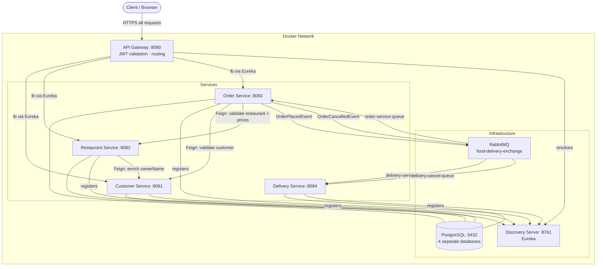

# System Architecture

## Service topology



---

## Synchronous communication (Feign)

All inter-service HTTP calls are internal-only. The gateway strips the `X-Internal-Service-Token` header from inbound requests; services only accept it from within the Docker network.

| Caller | Callee | Purpose |
|---|---|---|
| Order Service | Customer Service | Verify customer exists before placing order |
| Order Service | Restaurant Service | Validate restaurant + menu items, fetch prices |
| Restaurant Service | Customer Service | Enrich `ownerName` on restaurant read paths |

---

## Asynchronous communication (RabbitMQ)

Exchange: `food-delivery-exchange` (topic)  
Dead-letter exchange: `food-delivery-dlx` (direct)

| Event | Producer | Consumer | Queue | Effect |
|---|---|---|---|---|
| `OrderPlacedEvent` | Order Service | Delivery Service | `delivery-service-queue` | Delivery record created with status `ASSIGNED` |
| `DeliveryStatusEvent` (ASSIGNED) | Delivery Service | Order Service | `order-service-queue` | Order status → `CONFIRMED` |
| `OrderCancelledEvent` | Order Service | Delivery Service | `delivery-cancel-queue` | Delivery status → `FAILED` |

### Dead-letter queue configuration

Each queue is bound to a DLX. Messages that exhaust retry attempts (3 attempts, exponential backoff: 1s / 2s / 4s, max 10s) are routed to the corresponding `.dlq` queue for manual inspection:

- `order-service-queue.dlq`
- `delivery-service-queue.dlq`
- `delivery-cancel-queue.dlq`

---

## Fault tolerance (Resilience4j)

Circuit breakers are configured on all outbound Feign clients in Order Service and Restaurant Service.

| Service | Protected client | CB name |
|---|---|---|
| Order Service | CustomerClient | `customer-service` |
| Order Service | RestaurantClient | `restaurant-service` |
| Restaurant Service | CustomerClient | `customer-service` |

**Config (all instances):**
- Sliding window: 10 calls
- Failure threshold: 50%
- Wait in OPEN state: 10s
- Permitted calls in HALF-OPEN: 3
- Auto-transition OPEN → HALF-OPEN: enabled

**Fallback behaviour:**
- Order placement calls (customer/restaurant validation) → throw `ServiceUnavailableException` (503) — order is not placed
- Restaurant `ownerName` enrichment → fallback to `"unknown"` — restaurant reads continue uninterrupted

**Actuator endpoints:**
```
GET /actuator/circuitbreakers
GET /actuator/circuitbreakerevents
```
(Accessible directly on each service's port — not exposed through the gateway)

---

## Database layout

Each service owns its own schema and database. No cross-database joins.

| Database | Owner service | Key tables |
|---|---|---|
| `customer_db` | Customer Service | `customers` |
| `restaurant_db` | Restaurant Service | `restaurants`, `menu_items` |
| `order_db` | Order Service | `orders`, `order_items` |
| `delivery_db` | Delivery Service | `deliveries` |

Cross-service data (e.g. customer name on a restaurant response) is fetched at read time via Feign — never replicated at rest.

---

## Security model

| Role | Can do |
|---|---|
| `CUSTOMER` | Browse restaurants, place/cancel own orders, view own profile |
| `RESTAURANT_OWNER` | All CUSTOMER actions + create/edit own restaurants, manage menus, view restaurant orders, update order status |
| `SERVICE` | Internal service-to-service calls only (not reachable through the gateway) |

JWT tokens are issued by Customer Service and validated by the gateway's `AuthenticationFilter` on every request. The role is embedded in the token claims.
